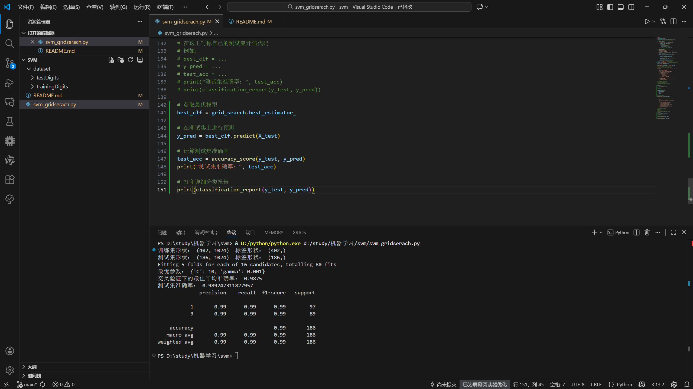

# 手写数字识别（SVM + GridSearchCV）课程作业

本项目用于完成机器学习课程中 **SVM 手写数字识别** 的编程作业。

目标：  
利用 `sklearn` 中的 **SVM（SVC）** 对手写数字数据进行分类，使用 **GridSearchCV** 搜索最优参数，并在测试集上的分类准确率达到 **98% 以上**。

## 作业提交说明：
1.代码：完成 src/svm_GridSearch.py 中第 4、5 部分的任务要求
2.截图：运行程序后，将终端中显示 测试集准确率（≥98%） 的输出界面截图上传
3.提交时PR 标题格式（必须遵守）：姓名 + 学号（张三1979701234）

